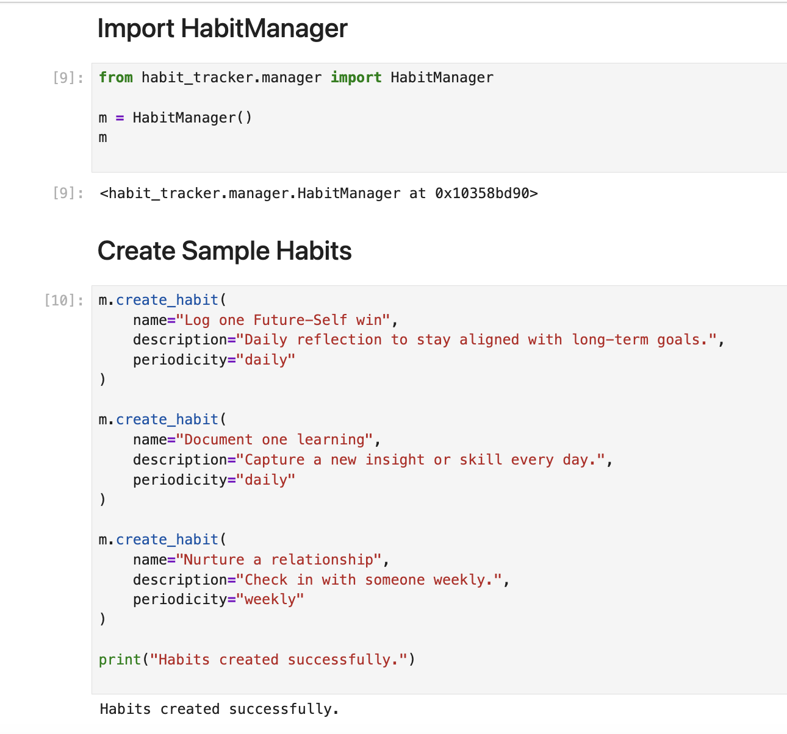
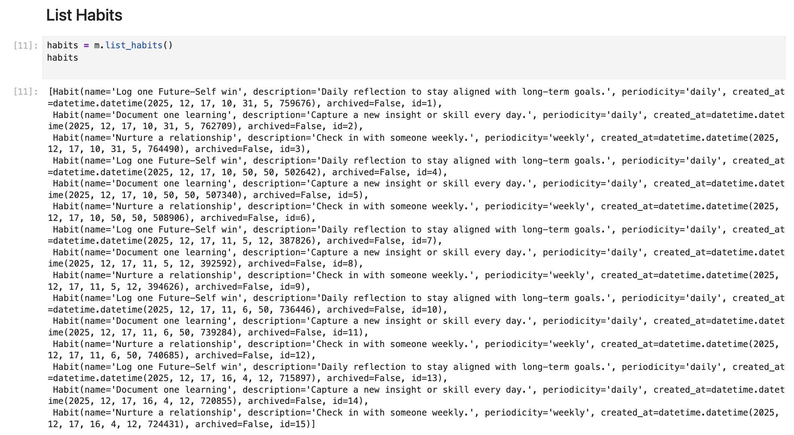
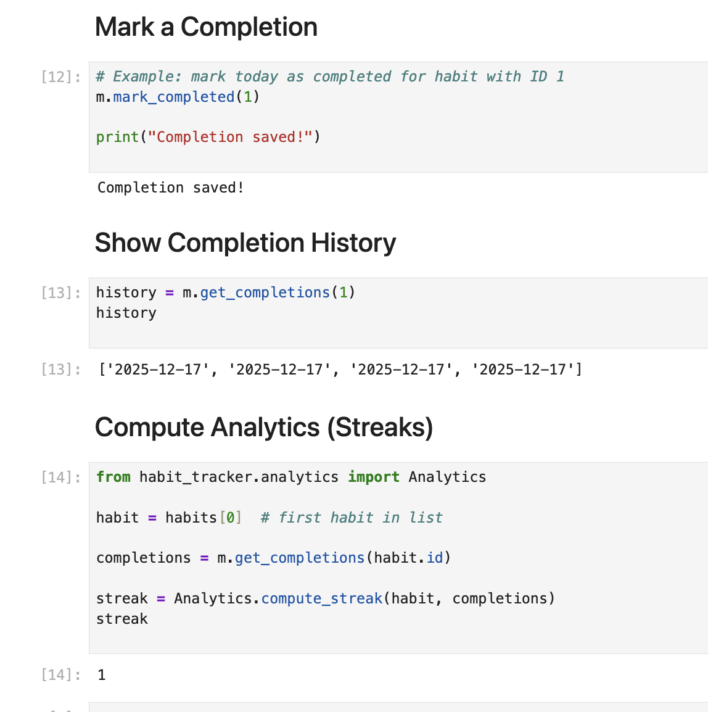
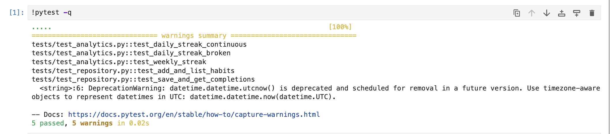

# Habit Tracker Application

A Python-based Habit Tracker developed for the **Object-Oriented and Functional Programming with Python** module.

This project supports creating habits (daily/weekly), tracking completions, and calculating streak analytics using **pure functional logic**. Data is persisted in **SQLite** (auto-generated locally).

---

## Features

- Create and manage habits (**daily** or **weekly**)
- Record completions and view completion history
- Compute streak analytics (daily + weekly rules)
- Clear separation of concerns:
  - **OOP** for domain + persistence
  - **Functional** analytics (pure, deterministic functions)
- Automated tests with **pytest**

---

## Project Structure

```
habit_tracker/
├─ habit_tracker/
│ ├─ init.py
│ ├─ habit.py # Habit domain model
│ ├─ repository.py # SQLite persistence layer
│ ├─ manager.py # Application-level API used by notebook/CLI
│ ├─ analytics.py # Pure analytics functions (no DB access)
│ └─ tests/
│ ├─ init.py
│ ├─ test_repository.py
│ └─ test_analytics.py
├─ data/
│ ├─ .gitkeep # Keeps the folder tracked in Git
│ └─ habits.db # Local DB (auto-created) - NOT committed
├─ run_app.ipynb # Demo notebook
├─ run_tests.ipynb # Test execution notebook
└─ README.md
├── screenshots/
│   ├── app_demo_1.png
│   ├── app_demo_2.png
│   ├── app_demo_3.png
│   └── tests_passing.png
```


---

## Requirements

- Python 3.10+

- pytest

- SQLite (built into Python via sqlite3)

**Note:** *The SQLite database file is generated locally and intentionally ignored by Git.*

---
## Core Components
### 1. Habit (habit.py)

Represents a single habit with attributes such as:
- id
- name
- description
- periodicity (daily/weekly)
- created_at
- archived

### 2. HabitRepository (repository.py)

Handles all persistence using SQLite via Python’s built-in sqlite3 module:
- Creating tables
- Adding habits
- Archiving habits
- Saving completions
- Retrieving completion history

### 3. HabitManager (manager.py)

Acts as the high-level API used by the notebook or CLI:

- Create habits
- List habits
- Mark completions
- Retrieve completion history
- Compute streaks via analytics

### 4. Analytics (analytics.py)

Contains pure functional logic:

- No database access
- No side effects
- Deterministic streak computation for daily and weekly habits

---

## Setup

From the project root (the folder containing README.md, data/, habit_tracker/, and run_app.ipynb):

### Create and activate a virtual environment
python -m venv .venv


### macOS / Linux

source .venv/bin/activate


### Windows

.venv\Scripts\activate

### Install dependencies
pip install --upgrade pip
pip install pytest

---

## Running the Application

### Option A: Jupyter Notebook (Recommended)

1. Open Jupyter Lab / Jupyter Notebook

2. Open run_app.ipynb

3. Run all cells from top to bottom

**The notebook demonstrates:**

- Habit creation

- Listing habits

- Marking completions

- Viewing completion history

- Computing streak analytics

---
## Application Demo

### Import and Create Habits


### List habits


### Mark Completion, View Completion History and Compute Analytics


### Tests Passing



---
## Running Tests

### Option A: Terminal (Recommended)

**From the project root:**

pytest -q

### Option B: Notebook

**Open and run:**

run_tests.ipynb


*All tests should pass locally.*

---
## Analytics & Streak Rules
### Daily Habits

- A streak increases for each consecutive calendar day with a completion

- Missing a day breaks the streak

### Weekly Habits

- A streak increases for each consecutive week with at least one completion

- Skipping a week breaks the streak

### Analytics functions are:

- Stateless

- Deterministic

- Fully test-covered

---
## Design Principles Applied
**1. Object-Oriented Programming**

    - Clear domain model (Habit)

    - Repository pattern for persistence (HabitRepository)

**2. Functional Programming**

    - Analytics implemented as pure functions (analytics.py)

    - No database access inside analytics

    - No hidden side effects

**3. Separation of Concerns**

    - Persistence, business logic, and analytics are isolated

**4. Testability**

    - Deterministic tests for analytics and repository behaviour

    - No reliance on global state
  
---
## Git & Data Handling Notes

- Database files (*.db) are ignored via .gitignore

- The data/ directory is tracked using data/.gitkeep

---
## Author

**Tshireletso Moloi** | 
Object-Oriented and Functional Programming with Python Module (2026)